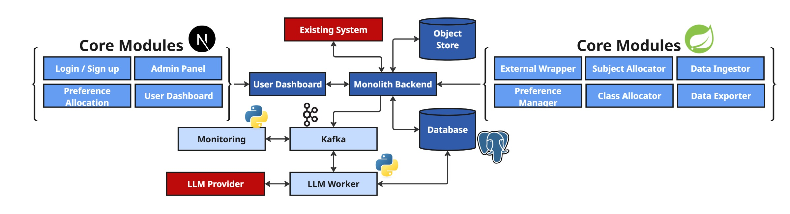
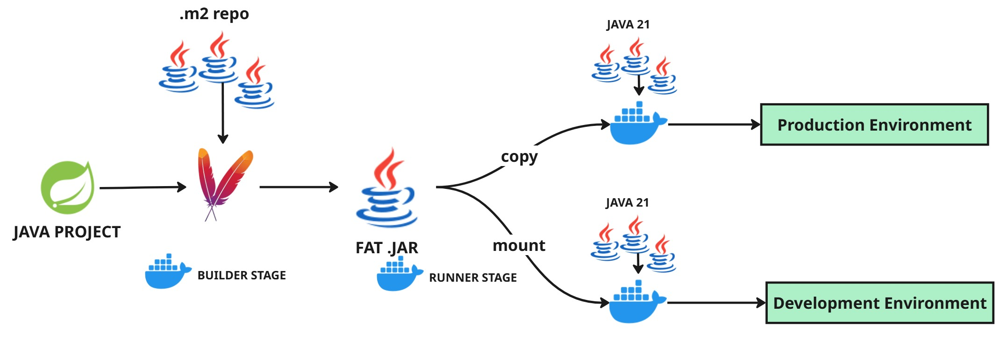

# Departmental Load & Timetable Management System
A centralized dynamic system to manage teaching loads and manage timetables on the fly. More details soon.

## Architecture
Architecture and techstack of the project is as follows:

## Build & Containerization Process (for a service)
A fat `.jar` file is built on the host machine outside docker (`BUILDER STAGE`). Then the fat `.jar` is placed in the container and run via `gcr.io/distroless/java21` (`RUNNER STAGE`).

